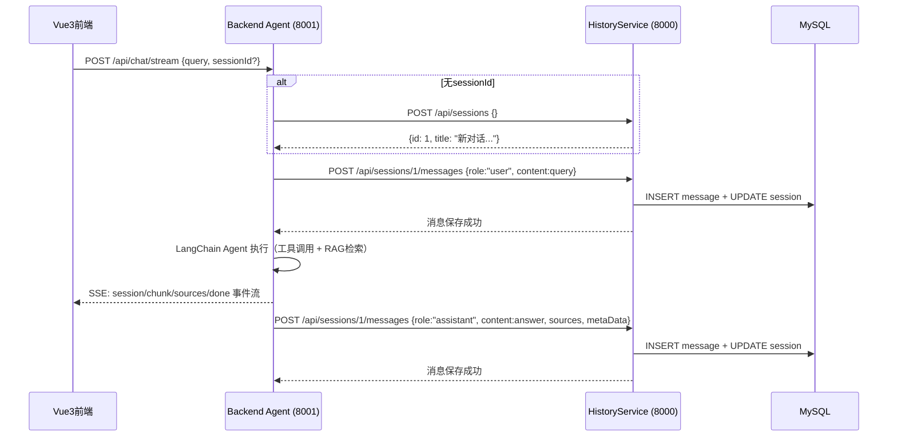

# Backend Agent API 文档

> **项目**: LangChain + RAG + FastAPI + Vue3  
> **服务**: Backend Agent (智能对话服务)  
> **端口**: 8001  
> **版本**: 1.0.0  
> **更新日期**: 2026-05-17

---

## 系统架构概览

```
──────────────────────────────────────────────────────────┐
│                      Vue3 前端                           │
│  (聊天界面 / 历史会话 / 用户中心)                         │
└────────────┬─────────────────────┬───────────────────────┘
             │                     │
             ▼                     ▼
────────────────────┐  ┌────────────────────────────────┐
│  Backend (Agent)   │  │  FastAPI_UserService            │
│  Port: 8001        │  │  _HistoryService                │
│                    │  │  Port: 8000                     │
│  - /api/chat       │──│  - /api/user/*  (用户认证)      │
│  - /api/chat/stream│  │  - /api/sessions/* (会话管理)   │
│                    │  │  - /api/sessions/{id}/messages/* │
│  LangChain Agent   │  │                                 │
│  ├─ rag_summarize  │  │  MySQL (用户/会话/消息持久化)    │
│  ├─ get_weather    │  └────────────────────────────────┘
│  ├─ get_user_loc   │
│  ├─ fetch_ext_data │  ┌────────────────────────────────┐
│  └─ ...            │  │  ChromaDB (向量知识库)           │
│                    │  │  - 扫地机器人100问               │
│  Qwen3-max (LLM)  │  │  - 故障排除/维护保养/选购指南    │
│  DashScope Embed   │  ────────────────────────────────┘
└────────────────────┘
```

**核心调用流程**:
1. Vue3 前端 → Backend Agent (`/api/chat/stream`) 发起对话
2. Backend Agent 调用 LangChain ReAct Agent 处理（含工具调用 + RAG 检索）
3. Backend Agent → HistoryService (`/api/sessions/{id}/messages`) 存储对话消息
4. Vue3 前端 → HistoryService 获取历史会话/消息列表

---

## 1. 通用说明

### 1.1 统一响应格式

所有接口返回 JSON，结构如下：

```json
{
  "code": 200,
  "message": "操作描述",
  "data": { ... }
}
```

| 字段 | 类型 | 说明 |
|------|------|------|
| code | int | 状态码，200 表示成功 |
| message | string | 操作结果描述 |
| data | object/array/null | 响应数据，错误时为 null |

### 1.2 认证方式

**Bearer Token**（Header: `Authorization: Bearer <token>`）

- 注册/登录后获取 token
- 所有需认证接口必须携带此 Header

### 1.3 错误码

| HTTP 状态码 | 说明 |
|------------|------|
| 200 | 请求成功 |
| 400 | 请求参数错误 |
| 401 | 未授权（Token 无效或过期） |
| 404 | 资源不存在 |
| 500 | 服务器内部错误 |

---

## 2. API 接口详情

> **Base URL**: `http://127.0.0.1:8001`

### 2.1 普通对话（非流式）

```
POST /api/chat
```

**Request Headers:**
```
Authorization: Bearer <token>
Content-Type: application/json
```

**Request Body:**
```json
{
  "sessionId": 1,               // 可选: 会话ID，不传则自动创建新会话
  "query": "扫地机器人迷路了怎么办？"   // 必填: 用户提问
}
```

| 字段 | 类型 | 必填 | 说明 |
|------|------|------|------|
| sessionId | int | 否 | 会话ID，不传则自动创建新会话 |
| query | string | 是 | 用户提问内容 |

**Response (200):**
```json
{
  "code": 200,
  "message": "success",
  "data": {
    "sessionId": 1,
    "answer": "扫地机器人迷路通常是以下原因导致的：1. 传感器被遮挡...",
    "sources": [
      { "title": "故障排除指南", "score": 0.92 }
    ],
    "metaData": {
      "model": "qwen3-max",
      "toolCalls": ["rag_summarize"]
    }
  }
}
```

---

### 2.2 流式对话（SSE 推荐前端使用）

```
POST /api/chat/stream
```

**Request Headers:**
```
Authorization: Bearer <token>
Content-Type: application/json
Accept: text/event-stream
```

**Request Body:**
```json
{
  "sessionId": 1,               // 可选: 会话ID
  "query": "扫地机器人迷路了怎么办？"   // 必填: 用户提问
}
```

**Response (200) — SSE 事件流:**

```
event: session
data: {"sessionId": 1}

event: chunk
data: {"content": "扫地"}

event: chunk
data: {"content": "机器人"}

event: chunk
data: {"content": "迷路通常是以下原因..."}

event: sources
data: {"sources": [{"title": "故障排除指南", "score": 0.92}]}

event: done
data: {"metaData": {"model": "qwen3-max", "toolCalls": ["rag_summarize"]}}
```

**SSE 事件类型说明:**

| 事件类型 | 说明 | data 结构 |
|---------|------|-----------|
| `session` | 会话信息（首次返回） | `{"sessionId": int}` |
| `chunk` | AI 回复文本片段（逐字推送） | `{"content": string}` |
| `sources` | RAG 检索来源（回复结束后推送） | `{"sources": array}` |
| `done` | 回复完成 | `{"metaData": object}` |
| `error` | 出错 | `{"message": string}` |

**Vue3 前端接入示例:**
```javascript
const sendChat = async (query, sessionId) => {
  const token = localStorage.getItem('token')
  const response = await fetch('http://127.0.0.1:8001/api/chat/stream', {
    method: 'POST',
    headers: {
      'Content-Type': 'application/json',
      'Authorization': `Bearer ${token}`
    },
    body: JSON.stringify({ query, sessionId })
  })

  const reader = response.body.getReader()
  const decoder = new TextDecoder()
  let buffer = ''

  while (true) {
    const { done, value } = await reader.read()
    if (done) break

    buffer += decoder.decode(value, { stream: true })
    const lines = buffer.split('\n')
    buffer = lines.pop() // 保留不完整的行

    for (const line of lines) {
      if (line.startsWith('event: ')) {
        currentEvent = line.slice(7)
      } else if (line.startsWith('data: ')) {
        const data = JSON.parse(line.slice(6))
        if (currentEvent === 'chunk') {
          // 追加到聊天界面
          appendMessage(data.content)
        } else if (currentEvent === 'session') {
          // 保存会话ID
          currentSessionId = data.sessionId
        } else if (currentEvent === 'sources') {
          // 显示参考来源
          showSources(data.sources)
        } else if (currentEvent === 'done') {
          // 回复完成
          onChatDone(data.metaData)
        }
      }
    }
  }
}
```

---

## 3. Agent 工具能力说明

### 3.1 ReAct Agent 工具列表

| 工具名 | 入参 | 出参 | 说明 |
|--------|------|------|------|
| `rag_summarize` | query: string | string | 从 ChromaDB 向量库检索扫地机器人知识 |
| `get_weather` | city: string | string | 获取指定城市天气信息 |
| `get_user_location` | 无 | string | 获取用户所在城市 |
| `get_user_id` | 无 | string | 获取用户ID（如"1001"） |
| `get_current_month` | 无 | string | 获取当前月份（如"2025-06"） |
| `fetch_external_data` | user_id: string, month: string | string | 获取用户某月使用记录 |
| `fill_context_for_report` | 无 | string | 报告生成场景上下文注入 |

### 3.2 典型对话场景 & 工具调用链

**场景1: 知识问答**
> 用户: "扫地机器人迷路怎么办？"  
> 工具链: `rag_summarize(query="扫地机器人迷路")` → 生成回答

**场景2: 天气适配**
> 用户: "今天合肥适合用扫地机器人吗？"  
> 工具链: `get_weather(city="合肥")` → 结合天气数据判断

**场景3: 使用报告**
> 用户: "给我生成使用报告"  
> 工具链: `get_user_id()` → `get_current_month()` → `fill_context_for_report()` → `fetch_external_data(user_id, month)` → `rag_summarize(query="保养建议")` → 生成报告

### 3.3 提示词切换机制

| 场景 | 提示词 | 触发条件 |
|------|--------|----------|
| 普通问答 | `prompts/main_prompt.txt` | 默认 |
| 报告生成 | `prompts/report_prompt.txt` | `fill_context_for_report` 工具被调用后，中间件 `report_prompt_switch` 动态切换 |

---

## 4. 后端服务间调用关系

### 4.1 Agent 调用 HistoryService 的场景



### 4.2 Agent 调用 HistoryService 的 API 清单

| 场景 | 调用 API | 说明 |
|------|----------|------|
| 无 sessionId 时 | `POST /api/sessions` | 自动创建新会话 |
| 保存用户消息 | `POST /api/sessions/{id}/messages` | role=user |
| 保存AI回复 | `POST /api/sessions/{id}/messages` | role=assistant, 附带 sources/metaData |
| 加载历史消息 | `GET /api/sessions/{id}/messages/all` | LangChain 多轮对话上下文 |

### 4.3 Agent 服务环境变量配置

Backend Agent 需要配置 HistoryService 的连接信息：

```env
# HistoryService 地址
HISTORY_SERVICE_BASE_URL=http://127.0.0.1:8000

# DashScope API Key（通义千问）
DASHSCOPE_API_KEY=sk-xxxxxxxx

# 数据库配置（HistoryService 使用）
# MySQL: root:123456@localhost:3306/news_app
```

---

## 5. API 接口总览

### Backend Agent 服务（Port: 8001）

| 方法 | 路径 | 说明 | 界面作用 |
|------|------|------|----------|
| `POST` | `/api/chat` | 普通对话（非流式） | 简单问答场景 |
| `POST` | `/api/chat/stream` | 流式对话（SSE） | 聊天界面实时输出 |

---

## 6. 跨域配置

Backend Agent (8001) 需配置 CORS：

```python
# backend FastAPI 中添加
from fastapi.middleware.cors import CORSMiddleware

app.add_middleware(
    CORSMiddleware,
    allow_origins=["http://localhost:5173"],  # Vue3 dev server
    allow_credentials=True,
    allow_methods=["*"],
    allow_headers=["*"],
)
```

---

## 7. 交互式 API 文档

启动服务后访问：
- **Swagger UI**: http://127.0.0.1:8001/docs
- **ReDoc**: http://127.0.0.1:8001/redoc
